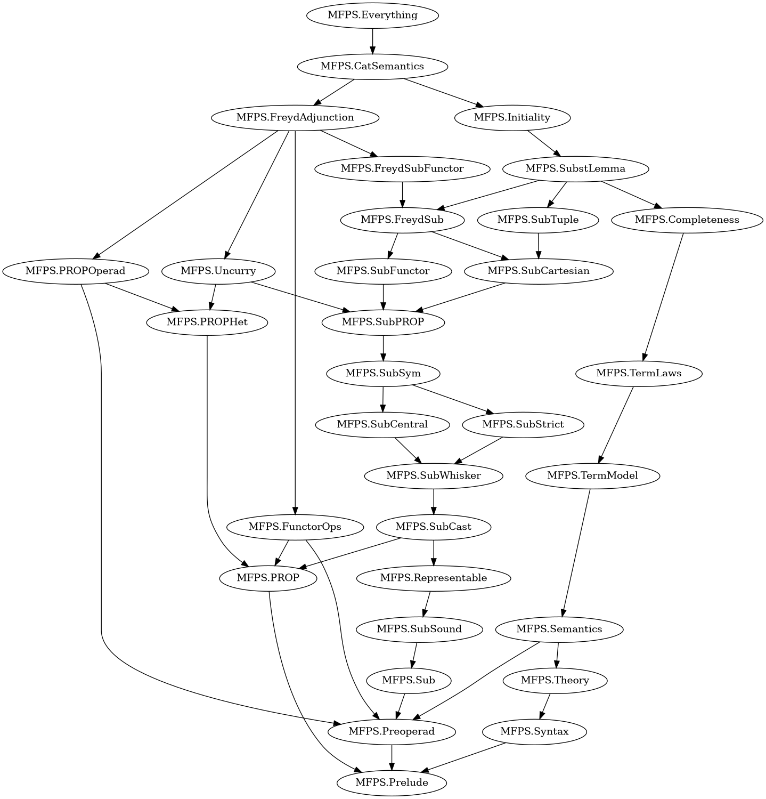

# Agda formalisation of "Multicategorical Semantics for Untyped Effects"

Cohen & Grunfeld, submitted to MFPS 2026 (`MFPS_2026_paper_15.pdf`).

Every module is checked with `--safe --without-K` (Agda 2.8.0, agda-stdlib 2.4).
There are no postulates and no holes. Every theorem, proposition, lemma and
corollary of Sections 3 and 4 and of Appendix A is proved (with the
corrections listed in `REPORT.md`); the remaining items are listed under
"Not formalised" below.

Every module starts with a header comment that names the paper items it
formalises and gives the proof in words; the paper → code map below points to
the main entries.

## Building

```
./check.sh src/MFPS/Everything.agda
```

`check.sh` calls the compiled Agda at `~/compiled/agda/agda-2.8.0` and passes
`--library-file=libraries`, which points at the standard library's own
`.agda-lib` (the user-level `~/.agda/standard-library.agda-lib` has an
`include:` path one directory too high, and the default `cubical` library makes
`Data.Nat.Base` ambiguous).

## Paper → code

| Paper item | Code | Status |
|---|---|---|
| §2.1 renamings, Lemma 2.3 | `MFPS.Prelude`: `Ren`, `_+ʳ_`, `σʳ`, `!ʳ`, `Δʳ`, `[_,_]ʳ`, `castʳ`, `IsCast` | proved |
| Defs 2.6–2.11 (pre-PROP, PROP, cartesian PROP, Freyd PROP, functors) | `MFPS.PROP`: `PrePROP`, `IsPROP`, `CartesianPROP`, `FreydPROP`, `PrePROPFunctor`, `CartesianPROPFunctor`, `FreydPROPFunctor` | definitions |
| Defs 3.1–3.9 (preoperads … Freyd operad functors), Defs 4.1–4.2 | `MFPS.Preoperad`: `Preoperad`, `RenCartesian`, `Symmetric`, `PreoperadFunctor`, `CartesianFunctor`, `Centrality`, `CartesianOperad`, `SymPreoperad`, `FreydOperad`, `FreydOperadFunctor`, `WeaklyClosed`, `ClosedFunctor` | definitions (corrected, REPORT §1, §5) |
| Def 3.11 words, Def 3.12 / Fig. 3 congruence, Def 3.15 ⋆ | `MFPS.Sub`: `Step`, `Word`, `Cong`, `_⋆_`, whiskering `_⊣ʷ_`, `_⊢ʷ_` | definitions |
| **Thm 3.16** soundness of Fig. 3 for ⋆ | `MFPS.SubSound.Soundness.⋆-sound` | proved |
| **Cor 3.17**, **Thm 3.18 (i),(ii)** | `MFPS.Representable`: `ηʷ`, `εʷ`, `η∘ε`, `ε∘η`, `η-nat` | proved |
| Def 3.13 `J^Sub`, **Thm 3.18 (iii)** | `MFPS.FreydSub`: `JSub`, `J-nat` | proved |
| **Prop 3.14 (i)** Sub_ℂ is a pre-PROP | `MFPS.SubPROP.SubPrePROP`, built from `MFPS.SubWhisker` (stability of every rule under whiskering), `MFPS.SubStrict` (strictness laws), `MFPS.SubSym` (symmetry: involution, units, hexagons, naturality `natL`/`natR`), `MFPS.SubCentral` (`central-rn`, `central-word`), `MFPS.SubCast` (arity casts) | proved |
| **Prop 3.14 (ii)** Sub×_𝕍 is a cartesian PROP | `MFPS.SubCartesian.Sub×PROP` (`natLk`/`natRk` general σ-naturality, `ΔNat-word`, `!-nat`) | proved |
| **Prop 3.14 (iii)** `J^Sub` respects the congruence, Sub is a Freyd PROP | `MFPS.FreydSub`: `JSub-cong`, `FreydSubPROP` | proved |
| **Prop 3.14 (iv)** functoriality in the operad | `MFPS.SubFunctor.GSubFunctor`, `MFPS.FreydSubFunctor.FSub` | proved |
| Def 3.19 (U on objects), **Lemma A.1** | `MFPS.PROPOperad`: `Restrict` (morphisms into 1 form a symmetric Ren-cartesian preoperad), `U.UD` (the Freyd operad U(D)), `UFunctor.UG` (U on morphisms); the underlying computations up to arity casts in `MFPS.PROPHet` (`_≋_`, `core-assoc`, `core-N`, `core-Sℓ/Sr`, `core-CEN`, `core-D`, `core-C`) | proved |
| Def 3.20, **Lemma A.2** (F is a functor) | `MFPS.FreydSubFunctor.FSub`, `MFPS.FreydAdjunction.FreeFunctorial` (`FSub-id`, `FSub-∘`); the categories `MFPS.FunctorOps` | proved |
| Def A.3, **Lemma A.4** (currying) | `MFPS.FreydAdjunction.Curry.curry` | proved |
| Def A.5, **Lemmas A.6, A.7, A.8, Cor A.9** (uncurrying) | `MFPS.Uncurry`: `Uncurry.⌊_⌋`, `⌊⌋-++`, `Sound.⌊⌋-cong` (every rule of Fig. 3 holds in the target), `Sound.⌊⌋-functor`; `MFPS.FreydAdjunction.Uncurry.uncurry`, `uncurry-J` | proved |
| **Lemma A.10**, **Thm 3.21 / Cor A.11** (F ⊣ U) | `MFPS.FreydAdjunction.Adjunction`: `curry∘uncurry`, `uncurry∘curry`, `uncurry-cong`; naturality `Naturality.natD`, `natM` | proved |
| Def A.12, A.14, **Lemma A.15** | `MFPS.CatSemantics`: `CatStructure`, `CatMorphism`, `UStr`, `UMor`, `catSound` | proved |
| **Cor A.13 / A.16** (F(term model) initial among categorical structures), completeness for categorical structures | `MFPS.CatSemantics`: `FreeTerm.FTerm` (weak closure on words `W-free`), `CatInitial.initial`, `CatInitial.unique`, `CatCompleteness.catComplete` | proved |
| §2.2 / Fig. 1 syntax, Def 2.4 substitution, Lemma 2.5 | `MFPS.Syntax` (de Bruijn, shared contexts), σ-calculus `ren-∘`, `sub-sub`, `ren-sub`, `sub-ren` | proved |
| Fig. 2 equational theory | `MFPS.Theory`: `_≈_`; closure under renaming `ren-≈` and substitution `sub-≈` | proved |
| Def 4.3 structures/morphisms, Def 4.4 interpretation, Def 4.6 | `MFPS.Semantics`: `Structure`, `StructureMorphism`, `Interp.⟦_⟧ᵛ/ᶜ`, `_⊨_≡_`; `MFPS.Completeness.Valid` | definitions |
| **Lemma 4.5 (a),(b)** | `MFPS.SubstLemma.Lemma45`: `ren-lemmaᵛ/ᶜ`, `sub-lemmaᵛ₀/ᶜ₀` (generalised over a renaming for the induction) | proved for every structure |
| **Thm 4.7** soundness | `MFPS.Semantics.Interp.Soundness.sound` (all rules; `runit-sound`), the (assoc) case `MFPS.SubstLemma.assoc-word`/`assocSound`, closed form `MFPS.SubstLemma.soundness` | proved |
| **Thm 4.8** the term model is a structure | `MFPS.TermModel` (operations, unit laws, renaming actions), `MFPS.TermLaws.termStructure` (associativity, symmetry, centrality, !/Δ-naturality, `return` central/discardable/copyable, β, λ-substitution) | proved |
| §4.3 tupling `plug` as a word | `MFPS.SubTuple`: `tupleʷ`, `plug-tuple₀`, `tuple-nat`, `tuple-pt` | proved |
| **Thm 4.9** initiality | `MFPS.Initiality.Initial`: `interp` (existence; `hole-move` for composition of computations, `app-word`), `unique` (uniqueness), `F-plug` | proved |
| **Cor 4.10** completeness | `MFPS.Completeness.complete` (via `term-interp`: ⟦E⟧ = E in the term model) | proved |
| `MFPS.Everything` | index | |

## Design decisions

* **Setoids, not quotients.** A preoperad is an ℕ-indexed family of setoids;
  the term model uses the inductive theory of Fig. 2 as its equivalence, and
  the substitution categories use the inductive congruence of Fig. 3.
* **Arity arithmetic.** The paper's strict identifications such as
  `(m₁+n₁)+(n+(n₂+m₂)) = m₁+((n₁+(n+n₂))+m₂)` are transported with `subst`
  along an *arbitrary* proof of the equation (all such proofs are equal, ℕ
  being a set); laws are quantified over the proof. In the Ren-cartesian
  setting a transport is the action of a cast renaming (`subst-ren`); in the
  substitution categories a cast is a renaming step `rn (castʳ p)`, and
  `IsCast` (`MFPS.Prelude`) with `isCast-unique` makes all cast steps of the
  same type interchangeable.
* **Steps carry their arity equations.** A substitution step
  `ins n₁ n₂ p q g : Step k k'` records `k ≡ n₁+(m+n₂)` and `k' ≡ n₁+1+n₂`, so
  whiskering and rule (A) need no explicit casts. Three administrative rules
  were added to Fig. 3: (I) steps are extensional in their operation up to ≈,
  (E) renaming steps are extensional in the renaming, (S) a step with arity
  proofs equals the on-the-nose step conjugated by cast renamings. All three
  are sound for ⋆ and are validated by every model.
* **Cartesian rules as a predicate.** The congruence `Cong Cart` applies the
  cartesian rules (CEN),(D),(C) to steps whose operation satisfies `Cart`.
  `Cart := const ⊤` is Sub×; for a Freyd operad, `Cart g := "g is a J-image"`
  is the congruence for Sub_ℂ (this is a correction, see REPORT §2).
* **Word equations.** Most semantic facts (Lemma 4.5, the (assoc) case,
  initiality) are proved as equations between words of Sub_ℂ, chained with
  `_⟶_` (`MFPS.SubSym`), and transferred to any structure by Thm 3.16
  (`⋆-soundᵛ/ᶜ`).
* **Computations in a pre-PROP up to casts.** In a pre-PROP the paper's
  on-the-nose identifications of arities are handled by the relation
  `f ≋ g` of `MFPS.PROPHet` ("equal after transporting along the unique
  arity equations"), which is an equivalence congruent for `∘`, `⊣`, `⊢`
  and makes the strictness axioms and the cast morphisms invisible. Each
  rule of Fig. 3 corresponds to one identity `core-…` between whiskered
  composites; the same identities give the operad laws of U(D) (Lemma A.1)
  and the soundness of the rules in D (Lemma A.7).
* **Categorical structures** (Def A.12) are defined as Freyd PROPs with a
  weak closure on U(D), so that Lemma A.15 holds on the nose; this states
  the paper's axiom ⊛ ∘ (J◁ⁿf▷ ⊢ 1) = f together with the naturality and
  substitution-compatibility of ◁ⁿ−▷ (see REPORT §5, §13).
* **Syntax.** Well-scoped de Bruijn terms `Trm n s`; position 0 is the leftmost
  variable and binders bind the last position, so the paper's `Γ, x ⊢ M` is
  `Trm (n + 1) cmp`. The paper's disjoint-context rules plus structural rules
  are replaced by the standard shared-context presentation; k-ary formers are
  interpreted by the parallel composite (`plug`) followed by the contraction
  `Δᵏ`, and `let` by the single substitution followed by `contr`.
* **Argument lists** of `f(V₁,…,Vₖ)` are a mutually inductive family `Args`
  (a function `Fin k → Val n` would need function extensionality).

## Not formalised

* Lemma 2.2 (generation of renamings): cited from the literature; the
  formalisation takes the full Ren-action as primitive (see REPORT §12).
* Section 5 (examples).


